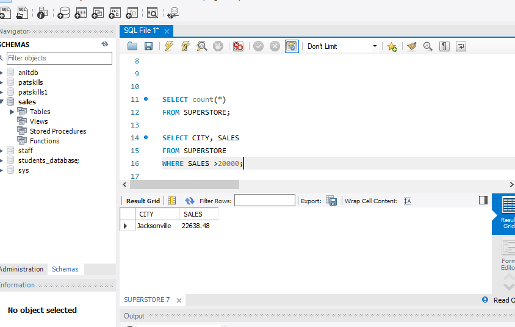

# SQLTASK4

## From the sales table below, I was able to discover the number of rows it has using the aggregate function COUNT

## In how many regions is the business operating?

## What is the total profit generated in the West Region?

## What is the average profit generated from the sales of the companys products?

## On average, how many days does it take for a customer to get their other item shipped?

## How many products does the company sell?

## Show the names and cities of the 5 customers that contributed most of the overall profit

## Show the sales generated by city where total sales is greater than 20,000.

